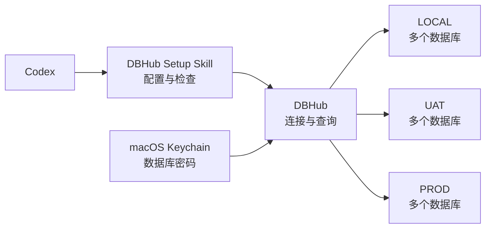

# DBHub Setup Skill

把 [DBHub](https://github.com/bytebase/dbhub) 更省事、更稳妥地用进真实项目。

DBHub 负责连接和查询数据库；这个 Skill 负责降低 DBHub 的设置与项目接入门槛，包括多套环境、多个数据库、macOS Keychain 凭据、只读工具、稳定版本资格检查和后续项目升级。

> [!IMPORTANT]
> 当前只在 **macOS + OpenAI Codex** 上完成验证。其他操作系统或 Agent 可以参考并改造这套流程，但凭据存储、Skill 路径和项目级 MCP 配置必须按目标平台重新验证。

> [!WARNING]
> DBHub 的 `readonly = true` 是应用层护栏，不能替代数据库级只读账号和最小权限。本 Skill 也不会把“能初始化 MCP”表述成“已经成功登录真实数据库”。

## 它解决什么

一个真实项目通常不止一个数据库，也不止一套环境：



这个 Skill 可以：

- 生成项目级 `.codex/config.toml` 和 DBHub TOML；
- 为多环境、多数据库生成明确命名的 MCP 工具；
- 将数据库密码留在 macOS Keychain，不写进项目文件或 AI 会话；
- 配置 `lazy = true`、`readonly = true` 和有上限的 `max_rows`；
- 在写入前生成 dry-run 计划，发现缺失凭据或冲突配置时停止；
- 对 DBHub 精确稳定版本运行固定的本地资格矩阵；
- 复用已验收、已锁定的运行环境，为项目执行轻量升级。

它不会：

- 替代 DBHub；
- 修改数据库授权或自动创建只读账号；
- 自动连接 UAT、生产或其他私有数据库；
- 把应用层只读限制宣传成完整的数据库安全边界；
- 声称已经验证 Windows、Linux、Claude Code、Cursor 等其他组合。

## 已验证范围

| 项目 | 状态 |
| --- | --- |
| macOS | 已验证 |
| OpenAI Codex | 已验证 |
| DBHub 多数据源项目配置 | 已验证 |
| macOS Keychain 凭据 | 已验证 |
| SQLite、PostgreSQL、MySQL、MariaDB、SQL Server 本地资格矩阵 | 已验证流程 |
| Windows / Linux 凭据存储 | 未验证，需要适配 |
| Claude Code / Cursor / 其他 Agent | 未验证，需要适配 |

## 安装

通过 `skills` CLI 安装到 Codex 全局 Skill 目录：

```bash
npx skills add daxiong888/dbhub-setup-skill \
  --skill dbhub-setup \
  --agent codex \
  --global
```

只查看仓库中可安装的 Skill：

```bash
npx skills add daxiong888/dbhub-setup-skill --list
```

安装后可以这样使用：

```text
使用 $dbhub-setup，先检查这个项目现有的 DBHub 配置，
然后为 LOCAL、UAT 和 PROD 的多个数据库生成 dry-run 计划。
不要读取或输出任何数据库密码。
```

或者：

```text
使用 $dbhub-setup 检查 DBHub 当前官方稳定版。
不要访问任何业务项目、Keychain 或真实数据库。
```

## 工作方式

### 项目接入

1. 检查现有项目配置和 Git 状态；
2. 收集数据库类型、地址、端口、库名、用户名、环境名等非敏感信息；
3. 生成 dry-run 计划；
4. 只检查 Keychain 条目是否存在，不读取密码；
5. 缺少密码时，由用户在终端隐藏输入；
6. 生成项目级配置和启动器；
7. 使用虚拟密码验证文件、权限、lazy 启动和工具注册；
8. 只有得到明确授权后，才对真实数据库执行连接检查。

### 稳定版资格检查

1. 从官方 npm registry 获取精确稳定版本元数据；
2. 校验包名、版本、integrity、shasum 和下载产物；
3. 锁定依赖闭包；
4. 在固定的本地数据库镜像矩阵中验证核心契约；
5. 生成可复用的资格凭据；
6. 项目升级复用已验证运行环境，不在每个项目重复下载和解析依赖。

## 开发与测试

运行 Python 测试：

```bash
cd skills/dbhub-setup/tests
PYTHONDONTWRITEBYTECODE=1 python3 -m unittest discover -v
```

资格脚本的 Node.js 依赖锁定在：

```text
skills/dbhub-setup/qualification/package-lock.json
```

完整资格矩阵需要本地 Docker 和清单中已经存在的精确镜像，不会隐式拉取镜像。

## 其他平台如何适配

可以把整个 Skill 交给目标 Agent，并明确要求：

```text
保留 DBHub Setup Skill 的 fail-closed、安全输出和 dry-run 边界，
将 macOS Keychain 替换为当前操作系统的安全凭据存储，
将 Codex 项目级 MCP 配置替换为当前 Agent 的配置格式，
补充对应平台的测试后再宣称支持。
```

不要简单删除 Keychain 检查，或把密码降级保存到仓库文件、Shell 历史、命令参数和 AI 会话中。

## 项目说明

这是社区维护的独立 Skill，不是 Bytebase 或 DBHub 官方项目。DBHub 名称及相关权利归其各自权利人所有。

## License

[MIT](LICENSE)
